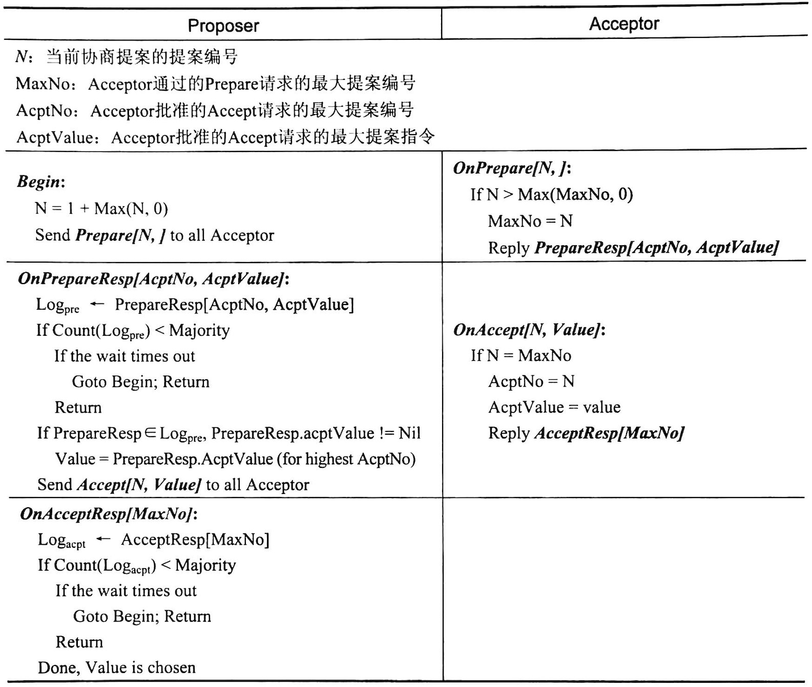
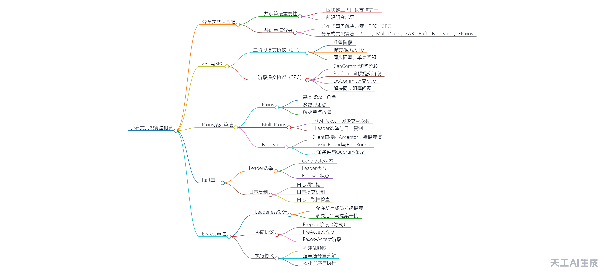

# Distributed Consensus Algorithm for Exam

# 第 2 章 2PC、3PC——分布式事务的解决方案

> Page 41

- **事务 (Transaction)**： 事务是数据库管理系统中的一个基本概念，它表示一组不可分割的操作序列。这些操作要么全部成功执行，要么在遇到任何错误时全部撤销，以保证数据库的一致性。
- **分布式事务 (Distributed Transaction)**： 分布式事务是涉及多个数据库节点的事务。在分布式系统中，由于数据可能被存储在不同的物理位置，因此需要一种机制来保证这些跨节点的操作能够像单个事务一样保持 ACID 属性。分布式事务的挑战在于确保所有参与的节点都能够协调一致地提交或回滚事务。
- **提案 (Proposal)**：在分布式共识算法中，提案是指一个节点向其他节点提出的一个建议，这个建议可能涉及到某个值的设置或者某个操作的执行。

> Page 46

- 为什么要引⼊`prepare` 阶段，⽽不是直接发起分⽀事务处理并提交？
- 为什么要锁定事务资源？
- 参与者为什么不直接提交，而是要等待 commit 在提交

> ⼆阶段提交协议的优缺点 Page 58

- 优点：容易理解、原理简单。
- 缺点：同步阻塞、数据不⼀致、单点问题和脑裂。

  - 同步阻塞：⼆阶段提交协议的阻塞主要体现在参与者需要协调者的指令才 能执⾏第⼆阶段的操作。当协调者发⽣故障时，参与者在第⼀阶段锁定的资源 将⼀直⽆法释放。
  - 数据不⼀致：在第⼆阶段，如果因为⽹络异常（不是协调者故障）⽽导致 ⼀部分参与者收到 Commit 请求，⽽另⼀部分参与者没有收到 Commit 请求， 那么结果将是⼀部分参与者提交了事务，⽽另⼀部分参与者⽆法提交。
  - 单点问题和脑裂：
    - 单点问题：⼆阶段提交协议过于依赖协调者，当协调者发⽣故障时，整个集 群将不可⽤。
    - 脑裂：当集群中出现多个协调者时，将不能保证⼆阶段提交协议的正确性。

> Thinking Page 59

从参与者接受 prepare，rollback 的情况和次序⻆度， 会有哪些问题出现？

# 第三章 Paxos 分布式共识算法

# 第四章 MultiPaxos

> Question Page 131

- 为什么需要有多个 Acceptor？单个 Acceptor 有什么问题？
- 提案编号解决了什么问题？
- 有三个成员的集群 A、B、C，其中，A 和 B 批准提案［4，6］，C 没有通过任何提案。此时 C 收到客户端请求，提案指令为 5 且 C 的提案编号为 4。通过 Basic Paxos 后，[unknownWord]后集群的每个成员批准的提案应该是什么？
- 有五个成员的集群 A、B、C、D、E，其中，A、B 批准了提案［1， X ］，D、E 批准了提案［2，Y ］ 。这时另⼀个提案的 Prepare 请求发 起 Prepare［3，］，按照 P2C 的约定，A、B 应该返回［1，X ］作为 Prepare 的响应，D、E 应该返回［2，Y ］作为 Prepare 的响应，那么这 时编号为 3 的提案值使⽤ X 还是 Y 呢？
- Multi Paxos 在没有提案冲突的情况下，在 Prepare 阶段最少执⾏ 多少次？最多执⾏多少次？
- 有三个成员的集群 A、B、C，其中，A 发起 PrepareA［1， ］请求 获得 A、B、C 的⽀持，B 发起 PrepareB［2，］请求获得 B、C 的⽀持， ⼆者都得多数派的⽀持，并且提案指令都由⾃⼰指定。Proposer A 发送 ［1，X ］ ，Proposer B 发送 ［2，Y ］ 。最终，A 批准提案［1，X ］ ， B、C 批准了提案［2，Y ］ ，这样就形成⼀致性了吗?

---

# New

## 共识算法相关定理内容及含义

- 分布式:将同一个应用的不 块分别部署,它们之间通过约定的通信协议进行交互.
- 集群:将同一应用部署在多台服务器,它们拥有相同的功能,所有成员都是平等的.
- 共识问题:在分布式系统中,要求一组(可能发生故障的)成员根据它们(可能冲突)的输入,就共同输出达成共识.
- ACID 理论——追求一致性

  - **原子性(Atomicity) **：在⼀组操作中,要么全部操作执⾏成功,要么全部操作执⾏失败,不存在中间数据,也不存在部分操作执⾏成功或失败的情况.在事务执⾏的过程中,如果某⼀个操作失败了,那么整个事务操作都将回滚,恢复⾄事务开始的状态。
  - **一致性(Consistency)**：事务的所有操作不会破坏数据的完整性,一个系统在数据完整的状态下执行事务之后,数据仍是完整的.
  - **隔离性(Isolation)** ：在多个事务在执⾏期间,事务与事务之间互不影响.
  - **持久性(Durability)** ：在事务执⾏成功之后,所有操作的执⾏结果都是永久的,哪怕服务发⽣故障.
- BASE 理论——追求可⽤性

  - **基本可用(Basically Available)** ：当分布式系统出现故障的时候，允许损失部分可⽤性， 但不等于系统不可⽤。这⾥的损失部分可⽤性通常包括两个⽅⾯：响应时间的损失和在功能上降级。
  - **软状态(Soft State)**：允许系统中的数据存在中间状态，并认为该状态不会影响系统的整体可⽤性，即允许多个不同节点之间的数据副本之间数据同步的过程存在延迟。
  - **最终一致(Eventual Consistency)**： 系统的所有副本在经过⼀个时间期限后最终达到⼀致的状态。
- CAP 定理
  CAP 定理阐述了在分布式系统中,系统数据一致性(Consistency)，可用性(Availability)，网络分区容错性(Partition Tolerance）这三个特性最多只能同时满足其中两个。

  - **一致性(Consistency)**:所有节点访问同一份最新数据副本。
  - **可用性(Availability)**:任何情况都能够处理客户端的每个请求.
  - **分区容错性(Partition Tolerance)**:发生分区时,系统应该持续提供服务.
- FLP 不可能定理
  FLP 不可能定理阐述了在不考虑拜占庭故障，并且⽹络⾮常稳定，所有的消 息都能被正确传递的情况下，也不存在⼀个完全异步的共识算法能容 忍哪怕只有⼀个成员发⽣故障的情况。
  即：在完全异步的⽹络环境中，安全（Safety）、活性（Liveness）和 容错（Fault Tolerance）三者只能选其⼆。

  - **安全**：所有成员必须认同已达成共识的值是同⼀个值，这是系统运⾏的最低要求。
  - **活性**：算法在有限的时间内达成共识，⽽容错不能⽆限循环下去，永远处于中间状态。
  - **容错**：允许部分成员发⽣故障，这不影响算法的正常运⾏。
- FLP 定理与 CAP 定理

FLP 定理与 CAP 定理很相似，但是描述的内容完全不同：

## Paxos 算法交互过程

## PPT 中第四章课后习题

1. 为什么需要有多个 Acceptor？单个 Acceptor 有什么问题？

**解：**在 Multi-Paxos 中，使用多个 Acceptor 而不是单个 Acceptor 有以下几个优点：

1. 提案编号解决了什么问题？

**解：**提案编号在 Multi-Paxos 中用于解决以下问题：

1. 有三个成员的集群 A、B、C，其中，A 和 B 批准提案［4，6］，C 没有通过任何提案。此时 C 收到客户端请求，提案指令为 5 且 C 的提案编号为 4。通过 Basic Paxos 后，⿎后集群的每个成员批准的提案应该是什么？

**解：** ［5，6］answer from teacher

1. 有五个成员的集群 A、B、C、D、E，其中，A、B 批准了提案［1， X ］，D、E 批准了提案［2，Y ］ 。这时另⼀个提案的 Prepare 请求发 起 Prepare［3，］，按照 P2C 的约定，A、B 应该返回［1，X ］作为 Prepare 的响应，D、E 应该返回［2，Y ］作为 Prepare 的响应，那么这 时编号为 3 的提案值使⽤ X 还是 Y 呢？

**解：**编号为 3 的提案的值应该使用 X。

根据 Multi-Paxos 的规则，Acceptor 在收到 Prepare 请求后，会根据其已接受的提案列表来响应。如果 Acceptor 已经接受了提案 ［1，X ］，则会返回提案 ［1，X ］。如果 Acceptor 已经接受了提案 ［2，Y ］，则会返回提案 ［2，Y ］。

由于 A、B 已经接受了提案 ［1，X ］，D、E 已经接受了提案 ［2，Y ］，因此编号为 3 的提案只能使用 X 或者 Y 其中一个值。由于 X 的提案编号小于 Y 的提案编号，因此编号为 3 的提案应该使用 X。

1. Multi Paxos 在没有提案冲突的情况下，在 Prepare 阶段最少执⾏ 多少次？最多执⾏多少次？

**解：**在没有提案冲突的情况下，Multi-Paxos 在 Prepare 阶段最少执行一次，最多执行两次。

最少执行一次是因为提案者需要向至少一个 Acceptor 发送 Prepare 请求。最多执行两次是因为提案者在收到多数 Acceptor 的 Prepare 响应后，会进入 Accept 阶段。如果提案者在第一次发送 Prepare 请求后没有收到多数 Acceptor 的 Prepare 响应，则需要重新发送 Prepare 请求。

1. 有三个成员的集群 A、B、C，其中，A 发起 PrepareA［1， ］请求 获得 A、B、C 的⽀持，B 发起 PrepareB［2，］请求获得 B、C 的⽀持， ⼆者都得多数派的⽀持，并且提案指令都由⾃⼰指定。Proposer A 发送 ［1，X ］ ，Proposer B 发送 ［2，Y ］ 。最终，A 批准提案［1，X ］ ， B、C 批准了提案［2，Y ］ ，这样就形成⼀致性了吗？

## PPT 中第五章课后习题

1. 有 A、B、C 三个节点，A 为 Leader,B 有 2 个已提交的 Proposal （<1,101>，<1,102>），C 有 3 个未提交的 Proposal（<1, 101>，<1,  102>，<1, 103>）。当 A 发⽣故障后，B 和 C 谁会当选 Leader？

**解：**C

1. 在选举过程中会出现选票被⽠分导致选举失败的情况吗？

**解：**不会

1. 有⼀个提案，在消息⼴播阶段，Leader 宕机，经过崩溃恢复后， 该提案是否会被提交？

**解：**不一定

1. 在崩溃恢复后，Leader ⾸先将⾃⼰的状态设置⼴播，然后再通知 其他成员进⾏修改。如果此时有事务请求，会执⾏成功吗？

**解：**可以，会加入队列

1. ZooKeeper 提供的最终⼀致性使任何成员都能处理读请求，但是 成员读到的可能是旧数据，如果必须要让成员读到最新的数据，应该怎么办？

解：

## 活锁问题、提案次序问题，及其解决方案

**Paxos 中的活锁问题**：多个 Proposer 同时发起提案时，每个提案的 Prepare 请求 和 Accept 请求交叉运⾏，相互⼲扰，导致最终选不了任何⼀个提案

Solution：为了缓解这个问题，在⽣产实践中，可以设定最⼩发起协商的超时，也就是说，在这个约定时间内，主动给其他 Proposer ⼀个机会，避免争夺。 约定在 Proposer 的 Accept 请求遭到拒绝后，需要等待最⼩发起协商的 超时后，才允许发起下⼀轮协商。

MutiPaxos 中引⼊ Leader ⻆⾊，只能由 Leader 发起提案，减少了出现活锁的概率，但不能完全避免。

Raft 和 ZAB 引⼊ Leader 和⽇志编号来规避活锁及提案顺序的问题。

EPaxos 解决活锁的⽅式就是拆分 Instance 的递增序列，每个成员都有⾃⼰的 Instance 列表，成员只能在⾃⼰的列表上发起提案协商。

---

提案次序

ZAB，Raft 是引⼊强 Leader 解决提案次序问题；

ZAB: zxid 标识着事务请求的先后顺序

Fast Paxos 和 Epaxos 是在不引⼊ Leader 情况下解决提案次序问题。

EPaxos:设计为两个协议：协商协议和执⾏协议。 前者使提案和依赖关系在集群中达成共识：后者按照特定的排序规则 对依赖关系进⾏排序并执⾏状态转移。因为依赖关系相同且排序规则 相同，所以最终每个成员执⾏状态转移的顺序也⼀定相同。

## 对各种典型共识算法特点的掌握

- Paxos 分布式共识算法：

Paxos 是一种解决分布式系统中达成一致性问题的算法，由 Leslie Lamport 在 1990 年提出。它通过三个阶段（Prepare、Accept、Learn）确保提案的最终一致性和正确性。Paxos 强调在出现故障时仍能保持系统运行，并且在某些情况下可以优化为两阶段提交。

- Multi Paxos 分布式共识算法：

Multi Paxos 是对 Paxos 的一种改进，引入了 Leader 角色以减少活锁的概率，并省略了 Prepare 阶段以提高效率。Multi Paxos 允许多个 Leader 存在，但多个 Leader 之间会相互干扰，因此需要引入租赁机制来保证连续的 Accept 阶段不被打断。

- ZAB 分布式共识算法：

ZAB（Zookeeper Atomic Broadcast）是 Zookeeper 使用的一种分布式一致性算法。ZAB 通过四个阶段（选举、发现、同步、广播）确保集群在崩溃恢复后能达成一致。与 Paxos 相比，ZAB 引入了强 Leader 模型来解决提案顺序问题，避免了乱序和冲突。

- Raft 分布式共识算法：

Raft 是一种基于强 Leader 模型的共识算法，它通过多数派决策保证一致性。Raft 使用任期和成员状态管理选举过程，日志复制确保数据同步。与 ZAB 相比，Raft 的日志流向是从 Leader 到 Follower，且 Follower 接受提案有条件。

- Fast Paxos 分布式共识算法：

Fast Paxos 是对 Paxos 的一种改进版本，允许客户端直接向接受者发送提案值以减少消息交互轮次。Fast Paxos 的关键在于设计合适的 Quorum 大小以确保一致性，同时讨论了不同故障容忍情况下的成员数和 Quorum 计算。

- EPaxos

EPaxos 是一种分布式共识算法，其特点是不引入 Leader，允许所有成员都能发起提案。这使得客户端不会在网络传输上浪费更多的时间，实现了跨地域场景下低延迟的有效手段。在这个模式下，不仅没有选举 Leader 的开销，也不存在受限于单一 Leader 的性能瓶颈。

EPaxos 通过拆分 Instance 的递增序列，每个成员都有自己的 Instance 列表，成员只能在自己的列表上发起提案协商。对于提案顺序问题，EPaxos 设计为两个协议：协商协议和执行协议。前者使提案和依赖关系在集群中达成共识；后者按照特定的排序规则对依赖关系进行排序并执行状态转移。因为依赖关系相同且排序规则相同，所以最终每个成员执行状态转移的顺序也一定相同。

- 消息⼴播与⼆阶段提交协议的区别
  - 消息⼴播仅需要多数派 Follower 的 ⽀持就可以进⼊第⼆阶段的提交操作，⽽⼆阶段提交协议需要所有成员都成功处 理后才可以执⾏第⼆阶段的提交操作；
  - 移除⼆阶段的中断/回滚操作， follower 要么 ack 给 leader,要么被认为放弃该 leader,进⼊故障恢复处理；
  - ⼆阶段是处理分⽀事务，⽽这⾥是处理相同的提案的共识问题，取分⽀事务的提案 值相同即可。

By 天工 AI

